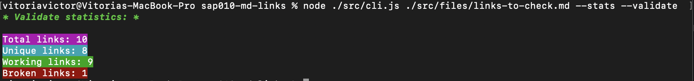

# MD-Links - Readme
### 
**Acesse o projeto:**

[](https://github.com/vitoriavictor/SAP010-md-links.git)

**Tecnologias utilizadas**

     

## Índice

* [Resumo do projeto](#resumo-do-projeto)
* [1. Fluxograma](#1-fluxograma)
* [2. Guia de instalação e uso](#2-Guia-de-instalação-e-uso)
* [3. Funcionalidades da Biblioteca](#3-Funcionalidades-da-Biblioteca)
* [4. Objetivos de aprendizagem alcançados](#4-objetivos-de-aprendizagem-alcançados)
* [5. Testes Unitários](#5-testes-unitários)
* [6. Desenvolvedora](#6-desenvolvedora)

***

## Resumo do projeto

[Markdown](https://pt.wikipedia.org/wiki/Markdown) é uma linguagem de marcação
muito popular entre os programadores. É usada em muitas plataformas que
manipulam texto (GitHub, fórum, blogs e etc) e é muito comum encontrar arquivos
com este formato em qualquer repositório (começando pelo tradicional
`README.md`). Os arquivos `Markdown` normalmente contém _links_ que podem estar
quebrados, ou que já não são válidos, prejudicando muito o valor da
informação que está ali.

Para este projeto, tomando esses parâmetros como base, foi criada uma biblioteca para verificar se existem links, e se eles estão válidos ou não, dentro dos arquivos Markdown, além de suas estatísticas.

## 1. Fluxograma 

**Linha de fluxo do programa**


## 2. Guia de instalação e uso

## 2.1 Instalação

Para começar a usar o ```md-links-vic```, você precisa tê-lo instalado no seu projeto. Para instalar a biblioteca, utilize o gerenciador de pacotes npm. No terminal, execute o seguinte comando:

```sh
$ npm install https://github.com/vitoriavictor/SAP010-md-links.git
```

## 2.2 Uso

Após a instalação, você poderá utilizar o Markdown Links através da CLI, basta executar o seguinte comando:
```sh
  mdlinks <caminho-do-arquivo> [options]
```

Onde:

- < caminho-do-arquivo > : O caminho para o arquivo markdown (.md) que deseja analisar.
 - [ options ] podem ser: 
  - --validate: (Opcional) Realiza a validação dos links, exibindo o status de cada link (ativo ou quebrado).
  - --stats: (Opcional) Exibe estatísticas dos links, como o total de links e links únicos.
  - --validate --stats: (Opcional) Validação e estatísticas dos links.

Por exemplo:

```sh
$ md-links ./diretorio-exemplo/exemplo.md --validate
```
+ *Exemplo de retorno no terminal para **validate***


```sh
$ md-links ./diretorio-exemplo/exemplo.md --stats
```
+ *Exemplo de retorno no terminal para **stats***


```sh
$ md-links ./diretorio-exemplo/exemplo.md --validate --stats
```
+ *Exemplo de retorno no terminal para **validate e stats***




## 3. Funcionalidades da Biblioteca

A biblioteca Markdown Links oferece as seguintes funcionalidades:

## 3.1 Extração de Links

+ *A biblioteca é consegue ler um arquivo markdown e extrair os links presentes nele. Os links são identificados pelo formato ```{File} [texto] (url)```*


## 3.2 Estatísticas de Links

+ *Utilizando ```--stats``` na linha de comando, a biblioteca exibirá as estatísticas sobre os links encontrados no arquivo markdown. Serão exibidas as informações sobre o total de links e a quantidade de links únicos.*


## 3.3 Validação de Links

+ *Utilizando  ```--validate``` na linha de comando, a biblioteca realizará uma requisição HTTP para cada link encontrado no arquivo markdown para verificar se estão ativos ou quebrados. Os links ativos terão o status "Ok | Successful response" e os quebrados terão o status "Fail | Error".*

## 3.4 Validação e Estatísticas de Links

+ *Utilizando ```--validate --stats``` na linha de comando, a biblioteca exibirá as estatísticas e a validação dos links encontrados.*

## 4. Objetivos de aprendizagem alcançados


## 5. Testes Unitários

**Cobertura dos Testes Unitários**


## 6. Desenvolvedora

Projeto desenvolvido por [Vitória Victor](https://github.com/vitoriavictor)

###
###